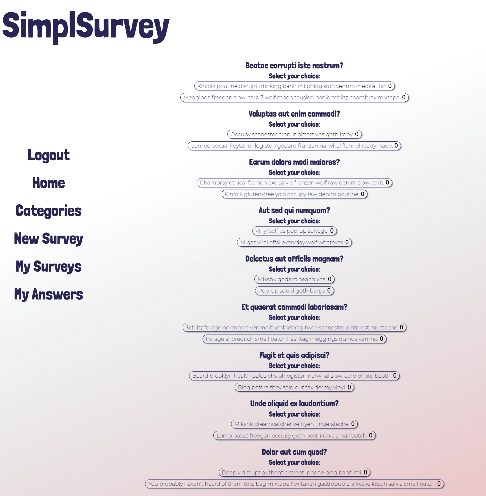
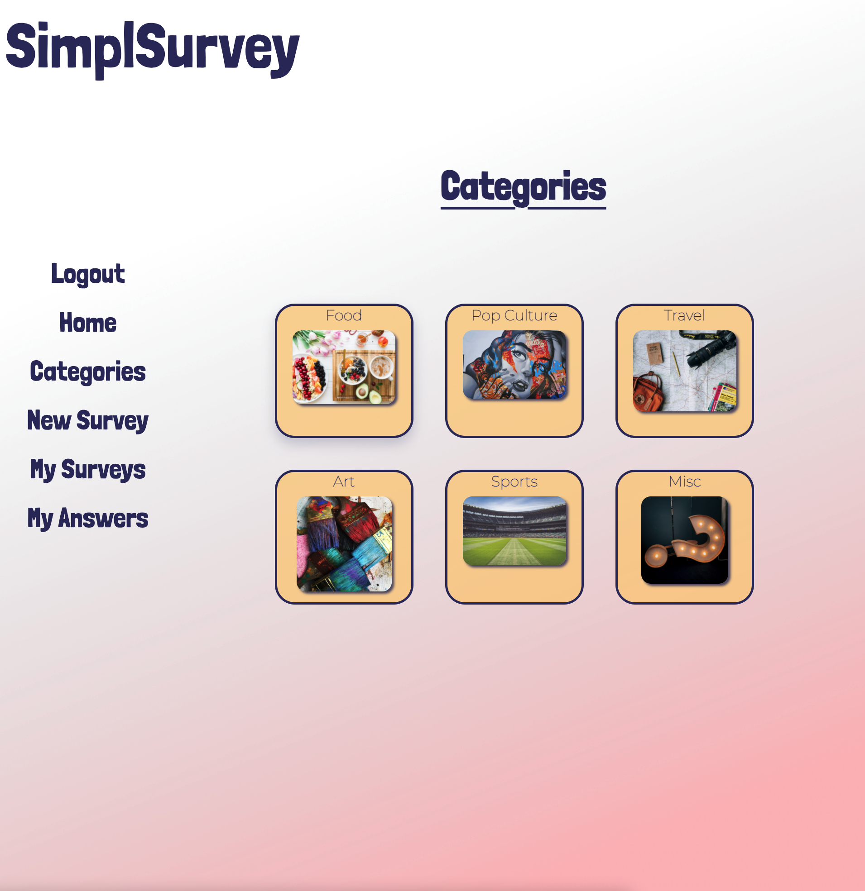
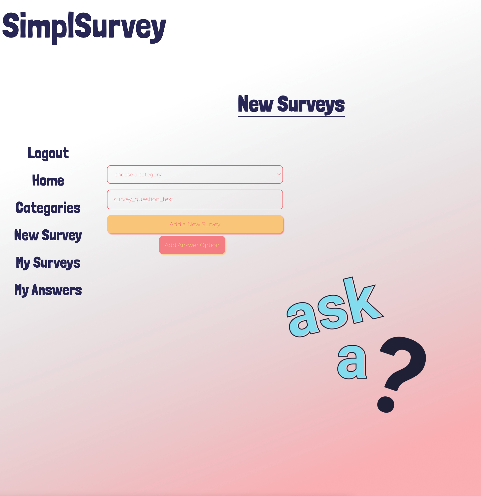
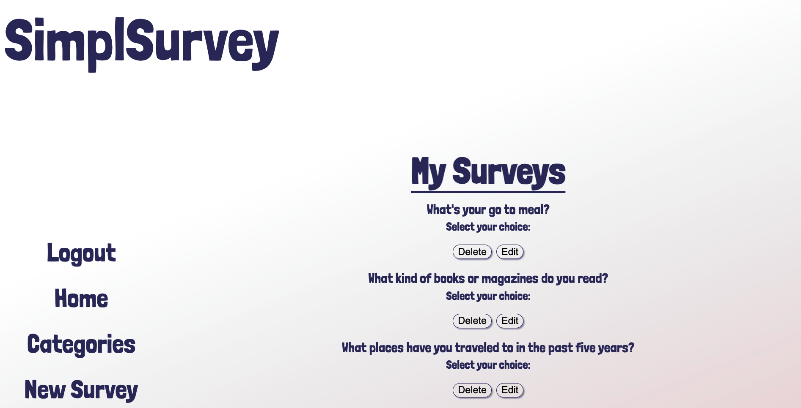
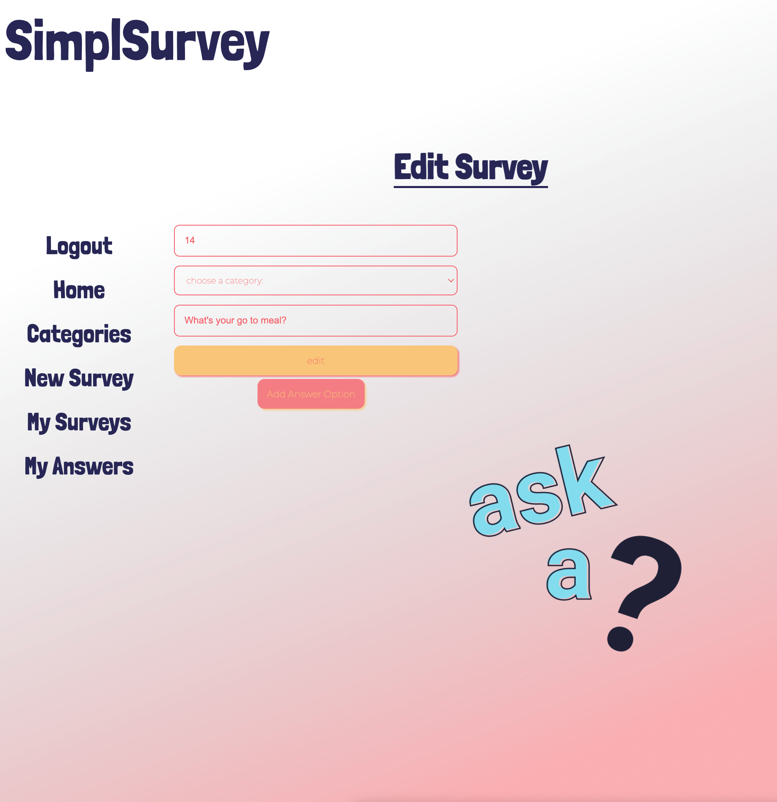

# SimplSurvey
SimplSurvey is a simple application where users can choose survey questions to answer from six different categories. The application also allows for execution of a customized survey of your choosing. Our goal was to focus on the formatting, grouping similar questions to keep surveys logical and focused as well as relevant. Choosing words over numbers and avoiding yes or no was a clear objective behind creating the Q&A for SimplSurey.

## `Technologies Used`
* HTML5
* CSS3
* JavaScript
* React
* Ruby
* Rails
* SQL
* [Color Hunt](https://colorhunt.co/)
* [Unsplash](https://unsplash.com/)
* [Imgur](https://imgur.com/)
* [Invisionapp](https://www.invisionapp.com/inside-design/design-resources/do/)
* [Lucid](https://lucid.app/documents#/dashboard?folder_id=home)
* [daFont](https://www.dafont.com/) 

## `User Stories`
* As a user, I would like to view all surveys
* As a user, I would like to create new surveys
* As a user, I would like to edit a created survey
* As a user, I would like to delete a created survey

## `Screenshots`

### Wireframe

### ERD

### Working App

 

## `Future Enhancements`
Go forward we would like to accomplish: 
* having each answer option increment/decrement with percentage after each vote
* we would like the My Surveys and My Answers pages to populate with each specific users created surveys and chosen answers
* we would like the categories page to lead you to a list of survey questions and answer options pertaining to that survey category 

## `Getting Started`
* [Click here](https://trello.com/b/0VMMsiyG/project-4) to see the Trello Board!
* [Click here](https://simplsurvey-frontend.herokuapp.com/) to see the deployed app!