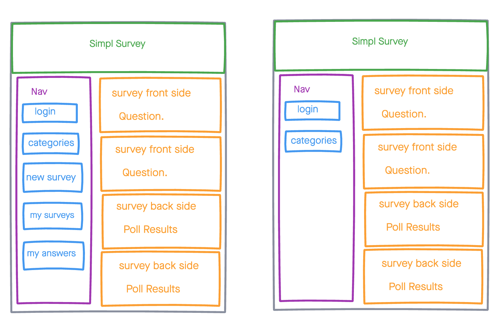
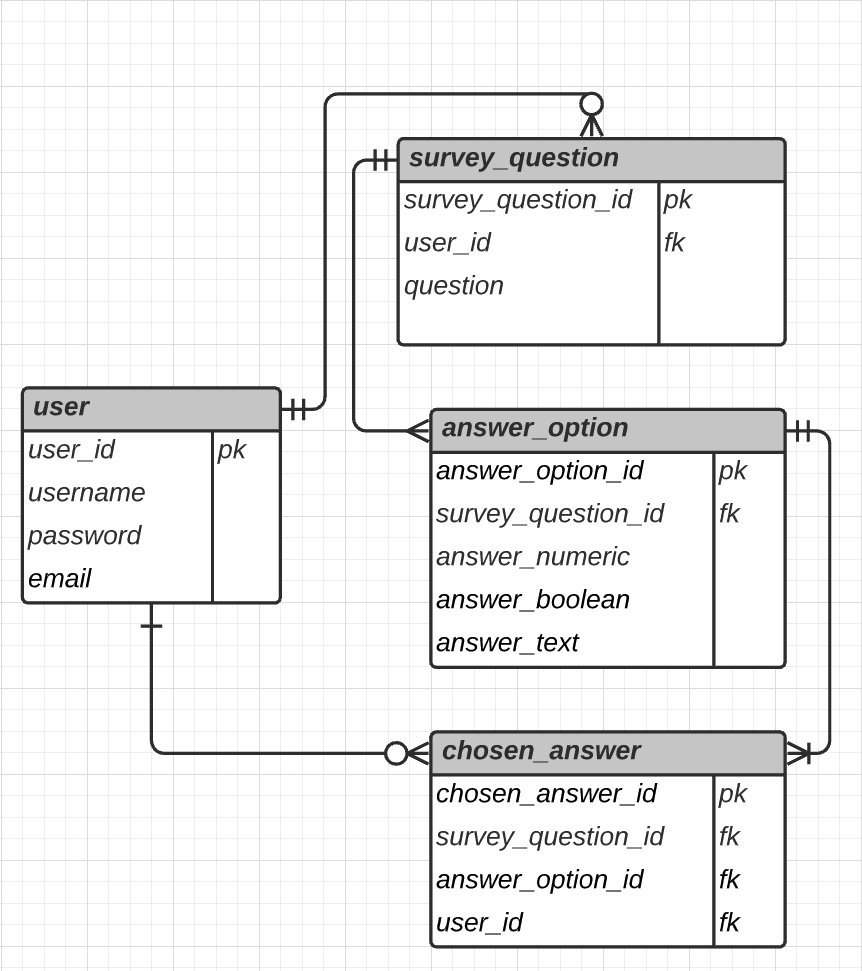

# SimplSurvey
SimplSurvey is a simple application where users can choose survey questions to answer from six different categories. The application also allows for execution of a customized survey of your choosing.

## `Technologies Used`
* HTML5
* CSS3
* JavaScript
* React
* Ruby
* Rails
* SQL
* [Color Hunt](https://colorhunt.co/)
* [Unsplash](https://unsplash.com/)
* [Imgur](https://imgur.com/)
* [Invisionapp](https://www.invisionapp.com/inside-design/design-resources/do/)
* [Lucid](https://lucid.app/documents#/dashboard?folder_id=home)
* [daFont](https://www.dafont.com/) 

## `User Stories`
* As a user, I would like to view all surveys
* As a user, I would like to create new surveys
* As a user, I would like to edit a created survey
* As a user, I would like to delete a created survey

## `Screenshots`

### Wireframe

### ERD

### Working App

## `Future Enhancements`
On the next sprint we would like to accomplish giving the user the ability to vote on a survey,

## `Getting Started`
* [Click here](https://trello.com/b/0VMMsiyG/project-4) to see the Trello Board!
* [Click here]() to see the deployed app!